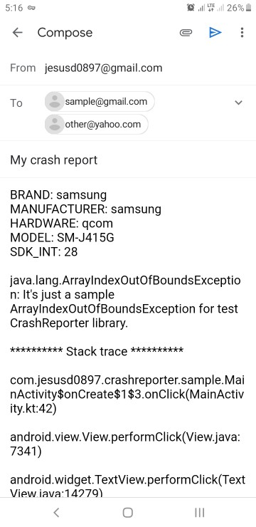

🐞 CrashReporter
=======
With CrashReporter you can provide direct feedback from users, detect bugs in apps and notify them to improve the final product.

[](https://jitpack.io/#jdsdhp/crash-reporter) 
[](https://android-arsenal.com/api?level=17) 
[](https://opensource.org/licenses/Apache-2.0)
[](https://twitter.com/jdsdhp)

## Screenshots
Dialog Notification | Email Functionality
:-:|:-:|:-:
 | 

## Including in your project

#### Gradle

```gradle
allprojects  {
    repositories {
        ...
        maven { url 'https://jitpack.io' }
    }
}
dependencies {
    implementation 'com.github.jdsdhp:crash-reporter:$version'
}
```

#### Kotlin
First of all it is necessary to add an Application class where `CrashReporterHandler` is used to receive the breaks.
```kotlin
class MyApp : Application() {
    override fun onCreate() {
        Thread.setDefaultUncaughtExceptionHandler(CrashReporterHandler(this))
        super.onCreate()
    }
}
```
#### XML
Now `MyApp` in` AndroidManifest` should be used as application.
```xml
<application
    ...
    android:name=".MyApp"
    ...
</application>
```
#### Kotlin
You can now use the library in your code. For example, this would be a full use in an activity. It should be clarified that the functionality of sending the error generated by email is the default handler. In case you don't want to use this, you should use `useAutoHandler = false` and the properties of `addresses` and `subject` would be deprecated while waiting for the actions to be handled manually through` ReportListener`.
```kotlin
try {
    trySendCrashReport(
        activity = this,
        addresses = arrayOf("sample@gmail.com", "other@yahoo.com"), //Optionl.  Only useful if useAutoHandler = true
        subject = "My crash report", //Optionl. Only useful if useAutoHandler = true
        useAutoHandler = false, //Optionl
        styleReporter = StyleReporter(  //Optionl
            title = "Dialog Title",
            message = "Dialog message",
            icon = ContextCompat.getDrawable(this, R.drawable.ic_round_bug_report)
        ),
        listener = object : ReportListener {  //Optionl
            override fun onNoNeeded() {
                //No crash trace detected.
                Toast.makeText(this@MainActivity, "No crash trace detected.", LENGTH_SHORT)
                    .show()
            }

            override fun onSendClick(errorTrace: String?) {
                //Handle error trace on Send option clicked.
                Toast.makeText(this@MainActivity, "SEND option clicked.", LENGTH_SHORT)
                    .show()
            }

            override fun onCancelClick(errorTrace: String?) {
                //Crash detected but Cancel option was clicked.
                Toast.makeText(this@MainActivity, "CANCEL option clicked.", LENGTH_SHORT)
                    .show()
            }
        })
} catch (ex: IntentResolveException) {
    //There are no handler available that satisfy this Intent
    Toast.makeText(this@MainActivity, ex.message, LENGTH_SHORT).show()
} catch (ex: Exception) {
    Toast.makeText(this@MainActivity, ex.message, LENGTH_SHORT).show()
}
```
## Sample project
It's very important to check out the sample app. Most techniques that you would want to implement are already implemented in the examples.

View the sample app's source code [here](https://github.com/jdsdhp/crash-reporter/tree/master/app)

License
=======

    Copyright (c) 2021 jesusd0897.
    
    Licensed under the Apache License, Version 2.0 (the "License");
    you may not use this file except in compliance with the License.
    You may obtain a copy of the License at
    
        http://www.apache.org/licenses/LICENSE-2.0
    
    Unless required by applicable law or agreed to in writing, software
    distributed under the License is distributed on an "AS IS" BASIS,
    WITHOUT WARRANTIES OR CONDITIONS OF ANY KIND, either express or implied.
    See the License for the specific language governing permissions and
    limitations under the License.
